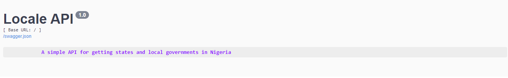
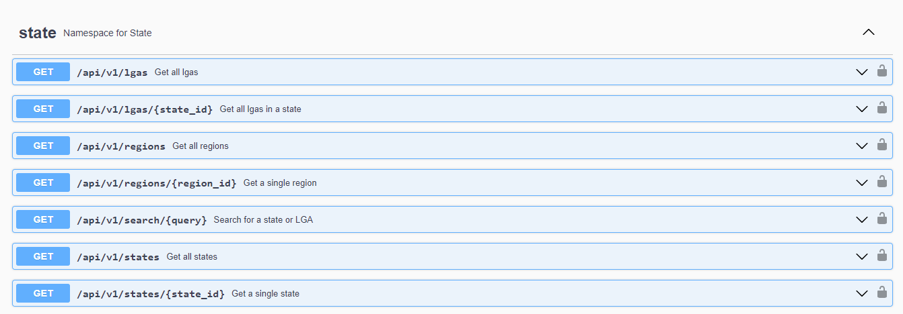
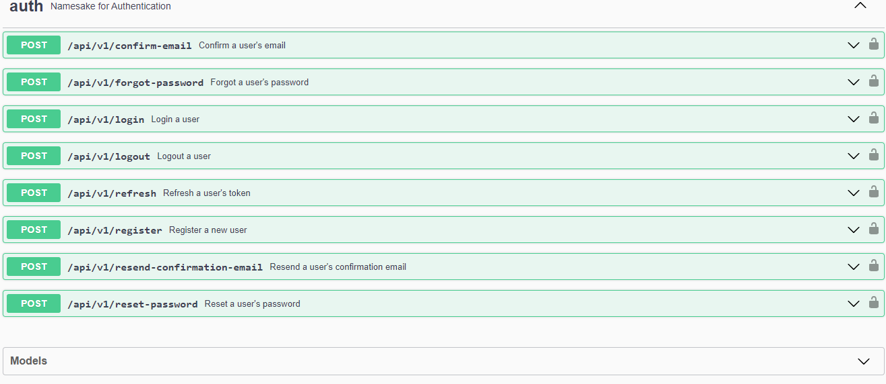

---

<!---Project Logo --->

<div align="center">
  <h1>
  </h1>
</div>

<div>
  <p align="center">
    <a href="https://github.com/AlxeverCodeX/Locale-API/wiki"><strong>Explore the Docs »</strong></a>
    <br />
    <a href="https://github.com/AlxeverCodeX/Locale-API/blob/main/images/2.png">View Demo</a>
    ·
    <a href="https://github.com/AlxeverCodeX/Locale-API/issues">Report Bug</a>
    ·
    <a href="https://github.com/AlxeverCodeX/Locale-API/issues">Request Feature</a>
  </p>
</div>

---


# locale_api
Locale is developer tool for anyone who needs to know Nigeria geopraphically. Locale's API shows you all Nigeria's regions, states, and local governement areas (LGAs). Locale is looking to be a very useful tool for the thousands of businesses building for Nigeria's 200M+ population size.


# Built With:


## Lessons Learned

Working this Project helped me understand these concepts:
* Rate Limiting
* Caching
* Debugging
* Routing
* Database Management
* API Security
* User authentication & authorization
* Documentation

# Installation

1. Clone the repository to your local machine
`git clone https://github.com/AlxeverCodeX/Locale-API.git`

2. Install the required packages using pip.
`pip install -r requirements.txt`

3. Activate Virtual Environment.
`source lo/Scripts/activate`

4. Start the Flask application.
`flask run`

 The application will be available at http://localhost:5000.


 ## Usage

To use this API, follow these steps:

1. Project URL: https://locale-42dr.onrender.com/

2. Create a User account

3. To register as a User, click on 'auth' to reveal the dropdown menu for the 
authentication and authorization route. You can register as a User via the 
'/api/v1/register' route

5. Sign in via the '/api/v1/login' route to generate a JWT token. Copy this access token without the quotation marks

6. Scroll up to click "Authorize" at top right corner. Enter the JWT token in this given format:
   ```
   Bearer thejwtaccesstoken
   ```

6. Click 'Authorize' and then 'Close'

7. Now authorized, you can have access to the enpoints. The API supports the following
   endpoints:
   
   GET /api/v1/lgas: Retrieves all Local Government Areas in the database.

   GET /api/v1/lgas/{state_id}: Retrieves all local government in a state by a specific id.

   GET /api/v1/regions: Retrives all regions with its metadata.

   GET /api/v1/regions/{region_id}: Retrieves a single region with its metadata.

   GET /api/v1/search/{query} : Search for a Local Government Area or State with the id.

   GET /api/v1/states : Retrieves all states and its metadata.

   GET /api/v1/states/{state_id}: Retrieves a single state with its metadata.


9. When you're done, click 'Authorize' at top right again to then 'Logout'
    
---

<!-- Sample Screenshot -->
## Sample

<div align="center">
  <h1>
  </h1>
</div>

---


<div align="center">
  <h1>
  </h1>
</div>


---

 ## Future Feature
 To add a frontend that can be used to consume this API


## Contact

Emmanuel Albert - [@alnuelCode_X](https://twitter.com/alnuelCode_X) - salberthp89@gmail.com

[Project Link](https://github.com/AlxeverCodeX/Locale-API)


## License

Distributed under the MIT License. See <a href="https://github.com/AlxeverCodeX/Locale-API/blob/main/LICENSE">LICENSE</a> for more information.


